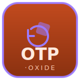

# oxide

Rust decoders for stage tracking and automation network protocols. Each crate
is receive-only, dependency-light, and `#![forbid(unsafe_code)]`. 

| | Crate | Protocol |
|---|-------|----------|
|  | [`psn-oxide`](crates/psn) | [PosiStageNet](https://posistage.net/) v2 — stage position tracking (UDP multicast, little-endian, chunk-framed) |
|  | [`otp-oxide`](crates/otp) | [OTP / ANSI E1.59](https://www.esta.org/) — object transforms (UDP multicast, big-endian, layered PDUs) |
|  | [`eap-oxide`](crates/eap) | Beckhoff TwinCAT [EAP](https://infosys.beckhoff.com/) Network Variables — PLC automation data (UDP, little-endian) |

```toml
[dependencies]
psn-oxide = "0.1"   # use psn;
otp-oxide = "0.1"   # use otp;
eap-oxide = "0.1"   # use eap;
```

Each crate exposes a pure decoder plus an optional `net` feature (on by default)
with a multicast/UDP socket helper. Wire formats for OTP and EAP were
reconstructed from public reference implementations and validated with
round-trip tests — see each crate's README for provenance and caveats.

## License

Dual-licensed under [MIT](LICENSE-MIT) or [Apache-2.0](LICENSE-APACHE), at your option.
