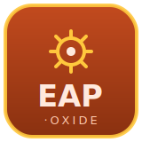

# eap-oxide

A decoder for **Beckhoff TwinCAT EtherCAT Automation Protocol (EAP) Network
Variables** in Rust.

EAP Network Variables (NWV) is the routable publisher/subscriber mechanism
TwinCAT uses to broadcast process data — axis positions, trims, statuses — over
standard Ethernet or UDP/IP. This is distinct from the cyclic EtherCAT fieldbus.
`eap-oxide` decodes published variable telegrams; you match variables by their
numeric id and interpret the bytes with the helper accessors.

- **Receive-only**, little-endian, zero `unsafe`.
- Pure decoder; optional `net` feature for a UDP bind helper (port `34980`,
  broadcast/multicast/unicast).

```rust
let telegram = eap::PublisherTelegram::decode(udp_payload)?;
for var in &telegram.variables {
    match var.id {
        1 => println!("winch 1 pos = {:?} m", var.as_f64_le()),
        2 => println!("deck state = {:?}",   var.as_bool()),
        _ => {}
    }
}
```

> **Provenance:** the wire format was taken from the Beckhoff-authored Wireshark
> EtherCAT plugin (`plugins/epan/ethercat/packet-nv.{h,c}`) — the de-facto
> reference — and validated with round-trip tests. The formal definition is
> ETG.1005. The `Hash` field (a data-type/version fingerprint) is treated as an
> opaque value to match against; its derivation is not publicly documented.

## License

MIT OR Apache-2.0.
