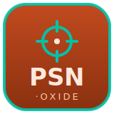

# psn-oxide

A [PosiStageNet](https://posistage.net/) (PSN) v2 decoder for Rust.

PosiStageNet is the open protocol (by VYV and MA Lighting) for streaming the 3D
position of tracked objects on stage over UDP multicast. `psn-oxide` decodes
both `PSN_DATA` (live transforms) and `PSN_INFO` (system and tracker names)
packets, and provides a multicast-socket helper.

- **Decode and encode** (receive and transmit), zero `unsafe`.
- Pure codec with no async runtime imposed — use it with blocking sockets,
  tokio, or anything else.
- Optional `net` feature (on by default) for ready-to-use multicast receiver
  and sender sockets.

```rust
use psn::{Packet};

match Packet::decode(datagram)? {
    Packet::Data(data) => {
        for tracker in &data.trackers {
            if let Some(p) = tracker.position {
                println!("tracker {} at ({}, {}, {}) m", tracker.id, p.x, p.y, p.z);
            }
        }
    }
    Packet::Info(info) => println!("system: {:?}", info.system_name),
}
```

Join the default PSN multicast group (`236.10.10.10:56565`):

```rust
let socket = psn::net::join_multicast(&psn::net::MulticastConfig::default())?;
```

PSN is little-endian and chunk-framed; see the crate docs for the packet layout.

## License

MIT OR Apache-2.0.
